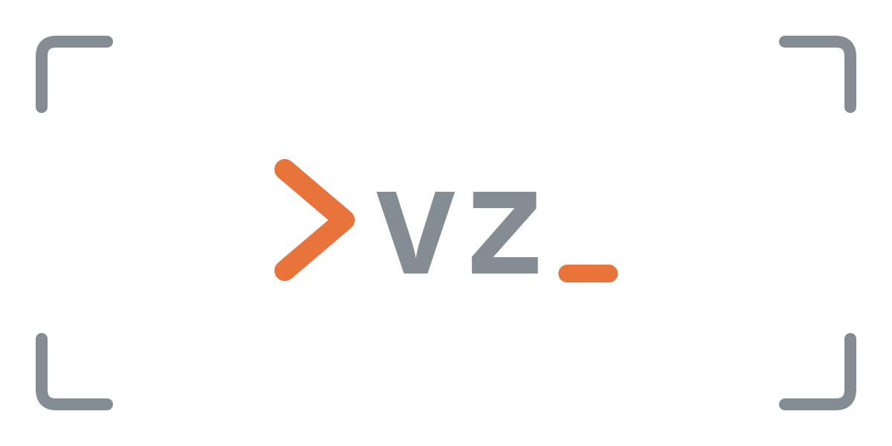

<p align="center">
  
</p>

<h3 align="center">One shell for every repo.</h3>

<p align="center">
  Versatile dev environments, everywhere, exactly as you want them.<br>
  As yourself, in any image, secure by default, and made for coding agents.
</p>

<p align="center">
  <a href="https://github.com/jan-blomquist/viz-shell/actions/workflows/gate.yml"></a>
  <a href="#license"></a>
  
  
</p>

<p align="center">
  <a href="#quick-start">Quick start</a> ·
  <a href="#why-vz">Why vz</a> ·
  <a href="#guide">Guide</a> ·
  <a href="#examples">Examples</a>
</p>

---

```console
$ whoami
sally
$ vz new
sally@vz-0-app:~/repos/app$ whoami
sally
```

Describe a repository's environment in a few lines of YAML. `vz` starts it in a container and drops
you in: as yourself, in your repository, with only what you chose to share. On a laptop, a server or
a CI runner, for you and for the agents working beside you.

> **Status:** young and moving fast. It works day to day, but the configuration may still change
> before 1.0. Feedback and issues are welcome.

## Why vz

- **Your repo, mounted.** `cd` into any git repository and type `vz new`. The repository is there,
  read-write, at the same path as on your host.
- **You, inside.** Same user, uid, groups, home and paths. Files you create stay yours; git and ssh
  just work; paths in errors match your editor's.
- **Any image.** Official images work unchanged, or `vz` builds the repository's own Dockerfile.
  Switch branches, switch environments; nothing rebuilds needlessly.
- **Configurations.** Yours in a library, the project's in the repository, chained by `extends`:
  `vz new -c trusted` for sudo and docker, `ci` for the pipeline.
- **Secure by default, made for agents.** No Linux capabilities, no sudo, no docker, no host network,
  no secrets, unless you grant them. Let an agent loose: of your machine, it reaches the repository
  and nothing else.
- **State that stays.** Caches, shell history and agent sessions survive the container, per
  repository, and never clutter your home.
- **Secrets out of sight.** Env files are read on the host and pass by name: never on a command line,
  never in a log.
- **Sessions.** Name a container, keep it, attach from any terminal: `vz new api`, `vz at api`.
- **One static binary.** No daemon, no runtime, no editor plugin. Just Docker.

## Quick start

Releases, with a one-line install script, are on the way. Until then, build from source (needs
[Rust](https://rustup.rs) and [just](https://just.systems)):

```sh
git clone https://github.com/jan-blomquist/viz-shell && cd viz-shell
just build && just install         # ~/.local/bin/viz-shell, and its alias vz
```

This repository is the worked example: three files.

```yaml
# vz.yml: the toolchain to build viz-shell, on the library's Debian
name: default
extends: vz-debian-trixie              # the library's base: sudo, the docker CLI, locales
image: { dockerfile: Dockerfile }      # ARG BASE: built on vz-debian-trixie's image
state:
  - /usr/local/cargo/registry          # survives the container, kept in .vz_state/
env:
  defaults: { RUST_LOG: info, CARGO_TERM_COLOR: always }
  files: [.env]                        # read on the host, never mounted
```

```yaml
# dev.vz.yml: the developer shell, on the toolchain
name: dev
extends: default
image: { dockerfile: dev.Dockerfile }  # fish, Node, opencode, Codex, Claude Code
shell: fish
state: [~/.config/fish, ~/.local/share/fish, ~/.codex, ~/.claude]
env:
  passthrough: [CLAUDE_CODE_OAUTH_TOKEN]
```

```sh
vz new            # the toolchain
vz new -c dev     # the developer shell
```

The first run writes your library, `~/.config/viz-shell/`: one configuration, `vz-debian-trixie`, and
the Dockerfile it builds. Your own additions are one more file, not checked in:

```yaml
# sally.vz.yml
name: sally
extends: dev
mounts:
  - ~/repos/notes:rw
env:
  passthrough: [GH_TOKEN]
```

## How vz differs

- **Not an editor plugin.** Dev Containers center on the editor; vz is shell-first. Use it with any
  editor, or none, over ssh, on a server, in CI.
- **Not a package manager.** Nix and Devbox assemble packages; vz runs whatever image you give it,
  and builds your Dockerfile when you give it one.
- **Not host integration.** Distrobox and Toolbox deliberately share your home and your host; vz
  isolates by default and shares only what the configuration declares.

## Guide

- [Use](#use)
- [Configurations](#configurations)
- [Sessions](#sessions)
- [Images](#images)
- [Your user in the image](#your-user-in-the-image)
- [State](#state)
- [Mounts](#mounts)
- [Share](#share)
- [Privileges](#privileges)
- [Environment](#environment)
- [Hooks](#hooks)
- [Examples](#examples)
- [Logging](#logging)
- [Development](#development)
- [License](#license)

## Use

```sh
vz new              # a shell: `shell`, else bash, else sh
vz -- cargo test    # one command instead
vz new -c ci        # the configuration ci, after what it extends; or VZ_CONFIG=ci
vz -f ci.yml        # also read this file, any YAML, as one of the repository's; repeatable
vz --show-effective-config   # the chain, its images, the result as YAML; runs nothing
vz configs          # the configurations of the repository and the library
vz new api          # a container named api; see Sessions
vz attach 0         # a shell in container 0 of this repository; or `vz at api`
vz ls               # this repository's containers; --all for every repository's
vz kill 0 api       # removes containers; --all for all of this repository's
```

`vz` alone lists the commands. `vz` (the alias of `viz-shell`) reads the [configurations](#configurations)
of the repository and your library, and runs the chain of the one asked for, `default` without `-c`. It pulls or
builds the image if missing, and runs a container, removed on exit unless `persistent`, with its
[hooks](#hooks): `create` once, `attach` before every shell or command. `vz` exits with the shell's,
or the command's, exit code. Inside:

- the repository is mounted read-write at its host path; the working directory is yours;
- you are you: same user, uid, group and home, so `whoami`, `~` and ssh work as on the host;
- `TERM`, `COLORTERM`, `LANG` and `VZ_LOG` are copied in when set. A `TERM` the image has no
  description for, as slim images lack those of newer terminals like ghostty, kitty or wezterm,
  becomes `xterm-256color`, so tmux, less and htop still work;
- `VZ_CONTAINER` names the container, `VZ_CONTAINER_CONFIG` its configuration, when not `default`, and `VZ_REPO`
  the repository root: for prompts, scripts and agents that want to know where they run.

`banner:` prints a banner above an interactive shell (never above `vz -- command`), in the
manner of fastfetch: what the shell is about to be. `true` shows the built-in art, `false` no banner,
and a string, art of your own above the facts; an empty one, the facts alone. Write it as a `|2`
block when its first line starts with spaces, so YAML knows the indentation. Colored on a terminal,
unless `NO_COLOR` is set.
The environment shows as a count, never names or values.

```
       _              _          _ _
__   _(_)____     ___| |__   ___| | |
\ \ / / |_  /____/ __| '_ \ / _ \ | |
 \ V /| |/ /_____\__ \ | | |  __/ | |
  \_/ |_/___|    |___/_| |_|\___|_|_|

sally@vz-0-app
--------------
Version: 0.1.0
Session: new, ephemeral
Repo: ~/repos/app
Branch: main
Chain: vz-debian-trixie (library) → default → dev → sally
Config: sally
Image: vz-app:3f9c2a1b7d4e8f60 (on vz-viz-shell:9a1c0d2e5b7f3a41)
Shell: fish
Sudo: yes
Docker: /run/user/1000/docker.sock
Network: host
Mounts: 4 (2 vz-debian-trixie.vz.yml, 1 vz.yml, 1 sally.vz.yml)
State: 2 paths in ~/repos/app/.vz_state
Env: 3 variables
Hooks: 2 create, 1 attach
```

The library's `vz-debian-trixie` writes the built-in art out in full, so it is there to edit; a later
configuration replaces it, or turns it off with `banner: false`.

`shell` picks the interactive shell: a name on the image's `PATH`, or an absolute path. It is also
`$SHELL` and your login shell inside. An image without it gives a warning, then bash, else sh, so a
library `shell: fish` doesn't break images without fish. Keep fish's configuration and history per
repository, apart from the host's, as state:

```yaml
shell: fish
state:
  - ~/.config/fish
  - ~/.local/share/fish
```

Unknown keys in a configuration are refused, naming the line.

## Configurations

A configuration is one YAML document: an image, state, mounts, env, hooks, and what the shell may
share and do. `vz new` runs `default`; `vz new -c NAME` runs `NAME`, after the configurations it
extends. Two places hold them: the **repository**, at the git root, and the **library**,
`~/.config/viz-shell/` (or under `$XDG_CONFIG_HOME`), for configurations a repository extends by name.

1. **Files.** `vz.yml`, `*.vz.yml` and `*.vz.yaml`, in the repository root, the library, and the
   folders the library's files list under `scan:`; nothing else is read, and a filename means nothing
   more. `-f FILE` reads another file, any YAML, as one of the repository's. `scan:` belongs in a file
   of the library folder, and is refused anywhere else.
2. **Documents.** A file holds one or more documents, separated by `---`; each is a configuration.
3. **Names.** `name:` is required, but for one configuration in each scope (the repository, the
   library with its `scan:` folders): the one without a name is `default`. Two without, or two of one
   name, in one scope are refused, naming both files. A configuration named `default` is an ordinary
   one.
4. **Extends.** One name, explicit; nothing is implied. It resolves to the repository's configuration,
   else the library's, never to itself: a repository's `trusted` with `extends: trusted` extends the
   library's. An unknown name is refused, listing the folders scanned and the names found; a cycle,
   naming it.
5. **Chain.** The parent's chain, then the configuration; later wins: settings (`image`, `state_dir`,
   `banner`, `shell`, `persistent`, `attach`) are replaced, `share` and `privileges` per key,
   `env.defaults` per variable name; in every list, an entry with an earlier one's key (a path; a name
   for passthrough; the command for hooks) updates it in its place, a new one comes last, and
   `enabled: false` removes one. A key twice in one list is refused. Paths are made absolute as each
   file is read, relative to its own folder, so an entry is removed however either file writes it.
6. **Images.** `image:` follows the chain: a Dockerfile declaring `ARG BASE` builds on the image
   before it; one without it, or an image reference, replaces ([Images](#images)). `ARG BASE` without
   a default requires an image before it, and is refused without one; `docker build .` then needs
   `--build-arg BASE=…`; `# check=skip=InvalidDefaultArgInFrom` under `# syntax=` silences BuildKit's
   lint about the missing default. An image holds only what its chain extends.
7. **Default.** Without `-c`: the repository's `default`. The library holds none: without one, `vz new`
   says ``no default configuration: add vz.yml with `extends: vz-debian-trixie`, or run with -c NAME``.

A repository writes the configurations it needs, `trusted` too:

```yaml
# vz.yml
name: default
extends: vz-debian-trixie
image: { dockerfile: Dockerfile }
mounts:
  - ~/repos                         # read-only
---
name: trusted
extends: default                    # default's lineage, then this
privileges: { sudo: true }
share: { docker: true, host_network: true }
```

A configuration of your own, beside the repository's: whether it is checked in is yours.

```yaml
# sally.vz.yml
name: sally
extends: default
image: { dockerfile: sally.Dockerfile }   # stacks on default's image
mounts:
  - ~/repos/shared-lib:rw                 # default mounts ~/repos read-only; this one, writable
  - ~/.config/gh
```

```dockerfile
# sally.Dockerfile
ARG BASE            # the repository's image, passed by vz; this file does not build alone
FROM ${BASE}
RUN apt-get update && apt-get install -y --no-install-recommends ripgrep \
 && rm -rf /var/lib/apt/lists/*
```

Run it with `vz new -c sally`, or `VZ_CONFIG=sally`. `--show-effective-config` prints the chain, one
line per configuration with its file, each image with its configuration, file and verdict, then the
result as YAML:

```
# vz-debian-trixie (~/.config/viz-shell/vz-debian-trixie.vz.yml)
# default (vz.yml)
# sally (sally.vz.yml)
# image: ~/.config/viz-shell/vz-debian-trixie.Dockerfile (vz-debian-trixie, ~/.config/viz-shell/vz-debian-trixie.vz.yml)
# image: Dockerfile (default, vz.yml, ARG BASE: required, stacks)
# image: sally.Dockerfile (sally, sally.vz.yml, ARG BASE: required, stacks)
```

`vz configs` lists every configuration, the repository's first: its name, file, what it extends, what
it changes.

- The chain is recorded on the container, in the labels `vz.chain` (`<config>@<file>`, fold order)
  and `vz.image` (tags, bottom first), and shown on entry as `Chain:`, attached or not, a library
  configuration marked `(library)`; `docker inspect` has it for debugging.

**The library.** The first `vz` writes one template when the library has no configuration named
`vz-debian-trixie`, from [`templates/`](templates), embedded in the binary, and never overwrites a
file: `vz-debian-trixie.vz.yml`, Debian trixie with sudo, the docker CLI and locales, what vz's
features need, every option written at its default with what flipping it does; and
`vz-debian-trixie.Dockerfile`, which it builds. A repository extends it by name. Add configurations of
your own beside it, for repositories to extend.

The portability test for a repository's configurations: no host path outside the repository, except
`state`, which lives inside it. Someone cloning the repository gets its environment; what it extends
from their library is theirs.

Trust: `vz` runs the configuration it is given; it cannot tell a hostile one, which can name any host
file or share the docker daemon. Review a repository's configuration as you would its code. What
protects the host is what reaches the container: only the repository, and what the configuration
shares, mounts or grants; and, unless `privileges.sudo` is granted, the secure floor inside it.

## Sessions

Every container is named `vz-<index>-<repository>`, its hostname too, so your prompt says which one
you are in. The index is the lowest free one of the repository's containers; `vz new api` adds a
name: `vz-1-app-api`. Labels (`vz.repo`, `vz.index`, `vz.name`, `vz.config`, …) identify them:
`vz ls`, `vz attach` and `vz kill` look containers up by label, by index or name.

```yaml
persistent: true    # the container outlives the shell that created it; `vz kill` removes it
attach: true        # `vz new` without a name joins this repository's container of the same configuration
```

| `persistent` | `attach` | `vz new` | the creating shell exits | the next `vz new` |
|---|---|---|---|---|
| false | false | a new container | it is removed | another new one |
| true | false | a new container | it is kept | another new one |
| true | true | a new container, or joins the kept one | it is kept | joins it |
| false | true | a new container, or joins the running one | it is removed, with attached shells | joins it |

- `vz attach [INDEX|NAME] [-- COMMAND]` (or `vz at`) runs a shell, or the command, in a container
  of this repository, as you; without a target, in the only running one. A stopped persistent
  container is started. `attach: true` joins unnamed containers only; a named one is attached by name.
- A container is entered only with its own configuration: `vz attach 0` to a container started with
  `-c trusted` is refused, naming `vz -c trusted attach 0`. `vz new` never lands in
  a trusted container.
- A container keeps the configuration it was created with; attaching after a change warns, and
  `vz kill` then `vz new` applies it. `vz -- COMMAND` joins as `vz new` does.
- Attaching is `docker exec` of vz's own binary: it waits for the entrypoint to finish setting you up,
  then becomes you, as the entrypoint does.

## Images

```yaml
image: hello-world            # pull
```

```yaml
image:                        # build; paths relative to the configuration file's folder,
                              #   or ~/… under your home, or absolute; ${repo}, ${home} substituted
  dockerfile: Dockerfile
  context: .                  # optional, default: the configuration file's folder
  args: { GREETING: hello }   # optional
```

- A built image is tagged `vz-<Dockerfile's folder>:<hash of Dockerfile + args>` and builds only
  when missing. One Dockerfile used by many repositories, say from the library's `vz-debian-trixie`, is one image.
  Editing the Dockerfile or args rebuilds; editing a copied file does not — remove the image to force it.
- Builds run `docker build`, via [docker-wrapper](https://github.com/joshrotenberg/docker-wrapper),
  so `.dockerignore` applies.
- This repository's `Dockerfile`: the Rust toolchain, fish as its shell, and `vz` built from the
  checkout, stacked on the base (below); alone, on pinned Debian, with what the base adds.

**Stacking.** A Dockerfile that declares `ARG BASE` before its first `FROM`, then `FROM ${BASE}`, is
built on the image the configurations before it in the chain resolved to: vz pulls or builds that one
first, then passes `--build-arg BASE=<its tag>`. Images follow the [chain](#configurations), so a later
configuration's Dockerfile lands on top. The base's tag joins the hash: a new base rebuilds what stacks on it. Three
forms: `ARG BASE=<default>` stacks, and with no earlier image builds alone on its default;
`ARG BASE` stacks, and with no earlier image is refused, naming the file; no `ARG BASE` (or `BASE`
set in `args`, or an image reference) replaces. `--show-effective-config` marks each image
`ARG BASE: stacks`, `ARG BASE: required, stacks`, `ARG BASE: its default` or `replaces`; the banner
shows `Image: vz-app:3f9c2a1b (on vz-tools:9a1c0d2e, debian:stable-slim)`.

**What an image needs.** Official images like `debian`, `alpine`, `rust`, `node` or `python` already
meet the contract. For your own images:

- a shell: `bash`, else `sh`, or the one `shell` names;
- tools under `/usr/local` or `/opt`, not in a home, so the image serves every user and `state`
  mounts in your home cannot shadow them;
- no reliance on an `ENTRYPOINT` (vz runs its own) or on a baked user (vz adds you);
- `sudo`, if a configuration grants `privileges.sudo`.

**Base image.** The first run writes the library's template, `vz-debian-trixie`
([`templates/vz-debian-trixie.vz.yml`](templates/vz-debian-trixie.vz.yml) and
[`templates/vz-debian-trixie.Dockerfile`](templates/vz-debian-trixie.Dockerfile), embedded in the
binary); its `image:` builds the Dockerfile, locally, on first use, as `vz-viz-shell:<hash>`. It
holds what vz's features need: sudo, the docker CLI, locales, ca-certificates; nothing else. A
repository extends it by name; edit it, or add a configuration of your own beside it with another
image.

**How the image is built.** apt when Debian's version will do. Otherwise the vendor's release,
downloaded from its URL and verified by sha256, or, for a static binary whose vendor publishes an
image as the way to get it, `COPY --from` that image. Every `FROM` is pinned by digest and every
download checksummed.

A repository stacks on it and adds what it needs:

```dockerfile
# The image this one builds on, passed by vz; `docker build .` needs --build-arg BASE.
ARG BASE
FROM ${BASE}
RUN apt-get update \
 && apt-get install -y --no-install-recommends git fish \
 && rm -rf /var/lib/apt/lists/*
```

An opinionated everyday image, with agents, shells and tools, is a repository of your own, built the
same way: a configuration of your own in the library for repositories to extend, or beside a
repository's own, stacked on its image ([Configurations](#configurations)).

Pin a version, never a moving tag: a new base is then an edit to the `FROM`, which changes the
image's hash, so the repository rebuilds on that branch, and only there.

## Your user in the image

**Default — added at start.** The image needs no user. `vz` starts the container as root with
itself as entrypoint, which adds your `/etc/passwd` and `/etc/group` lines, creates your home,
then becomes you. One image serves everyone; your home starts empty.

**Opt-in — baked at build.** For tools installed into your home or files owned by you, declare
any of these build args; `vz` passes your values:

| Arg | Value | | Arg | Value |
|---|---|---|---|---|
| `VZ_USER` | user name | | `VZ_GROUP` | group name |
| `VZ_UID` | uid | | `VZ_HOME` | home path |
| `VZ_GID` | primary gid | | | |

```dockerfile
ARG VZ_USER
ARG VZ_UID
ARG VZ_GID
ARG VZ_GROUP
ARG VZ_HOME
RUN groupadd -g "$VZ_GID" "$VZ_GROUP" \
 && useradd -u "$VZ_UID" -g "$VZ_GID" -d "$VZ_HOME" -m -s /bin/bash "$VZ_USER"
# Later build steps run as you.
USER $VZ_USER
```

Alpine: `addgroup -g "$VZ_GID" "$VZ_GROUP" && adduser -D -u "$VZ_UID" -G "$VZ_GROUP" -h "$VZ_HOME" "$VZ_USER"`.

- Declared args join the image hash, so such an image is built per user.
- At start, a baked user must match you: name, uid and home; group name and gid.
  Anything else holding your name, uid or gid is refused, naming it.
- Always pass `-d "$VZ_HOME"`. On Ubuntu 23.04+, `userdel -r ubuntu` first: it holds uid 1000.
- `USER` affects only the build; the container always starts as root for the entrypoint.
- Don't set these in a configuration's `args`: they would override yours and fail the match.

## State

Container paths whose contents survive the container. Each is kept in the state folder, `.vz_state/`
at the git root by default, at its own container path and mounted back; the host's own files are untouched.

```yaml
state_dir: .vz_state                   # optional: the state folder, see below
state:
  - ~/.local/share/opencode            # a folder
  - /var/cache/apt                     # any absolute path
  - { path: ~/.config/opencode/opencode.json, type: file, init: "{}" }   # a file, "{}" the first time
```

| Entry | Inside | Kept at |
|---|---|---|
| `~/.local/share/opencode` | `/home/sally/.local/share/opencode` | `.vz_state/home/sally/.local/share/opencode` |
| `/var/cache/apt` | `/var/cache/apt` | `.vz_state/var/cache/apt` |

- Expanded: `{ path, type: dir | file, init, enabled }`. `init` is a file's content when `vz`
  creates it; never rewritten.
- `state_dir`: relative to the configuration file's folder, `~/…` or absolute. Without it every configuration,
  `-c` ones included, shares `.vz_state/` at the git root.
- `vz` creates missing entries as you. Delete the state folder to start over; ignoring it in git is up to you,
  but keep it out of Docker build contexts: `**/.vz_state/` in `.dockerignore`.
- A state folder hides what the image had at that path, and belongs to you.
- A `file` suits tools that update in place. One that saves by rename (`git config`) fails with
  "Device or resource busy": keep a folder and point the tool into it.
- Paths start with `~/` or `/`, without `.`, `..` or `//`, and may not hold or sit inside the repository.

## Mounts

Host paths shown inside, reusing the host's own files: at the same path, unless a target names
another. Written as docker's `-v`: `path[:target][:ro|rw]`. Mounts are read-only unless `:rw`.
The default is read-only, `vz`'s secure-by-default posture; a mount says `:rw` to be writable.

```yaml
mounts:
  - ~/.config/gh:rw                                     # read-write
  - ~/repos                                             # read-only
  - ~/repos/skills:~/.agents/skills                     # elsewhere inside
  - ~/repos/skills:~/.config/opencode/skills            # one source, several targets
```

The map form says the same, key by key, and adds `enabled: false`, which removes an entry an
earlier layer added:

```yaml
mounts:
  - { path: ~/.config/gh, mode: rw }
  - { path: ~/repos/skills, target: ~/.agents/skills, enabled: false }
```

- Each path starts with `~/` or `/`; anything else, a mode other than `ro` or `rw`, or an empty
  field is refused, quoting the entry.
- The repository `vz` runs for is always read-write, even inside a read-only mount like `~/repos`:
  deeper mounts land on top. A mount that lands on the repository itself is skipped, so one repository
  can be read-write for every session, its own included: `- ~/repos/notes:rw`.
  `VZ_LOG=viz_shell=debug` shows the skip.
- A mount must exist on the host; `vz` never creates one.
- A single file mounts too, with two catches: a read-write one breaks tools that save by renaming
  over it ("Device or resource busy"), and a running container keeps seeing the old version when
  the host replaces the file by renaming, as many editors and `git config` do. Folders have neither.
- `- ~/.ssh` gives ssh inside your keys, `config` and `known_hosts`, as on the host. The keys are
  then readable by everything in the container: mount it only where you trust what runs there.
- Mounts are keyed by their target, where they land, else their path: a later configuration updates or removes
  one by it, in either form, and one source may land in several places.
- A mount may land inside a state folder, such as a library inside a tool's persisted config: `vz`
  creates its mount point in the state folder, as you. It may not hold a state path, sit on one, or
  lie inside a state file.
- Paths follow the state rules.

## Share

What of the host the shell shares; nothing unless a layer turns it on.

```yaml
share:
  docker: true         # the host's docker daemon
  host_network: true   # the host's network stack
```

- `docker`: the socket behind the current docker endpoint (it follows `DOCKER_HOST` and
  `docker context use`) is mounted at its own path, `DOCKER_HOST` points at it, and you join its
  group: docker works inside as you, without sudo. The image needs the docker CLI.
- Sharing the daemon gives the shell root-equivalent control of the host: only for trusted repositories.
- `host_network`: `--network host`, the host's network stack, its `localhost` and its ports. Without
  it the shell still reaches the internet, through docker's own network, and the host answers to
  `host.docker.internal`, as in Docker Desktop, but not on its `localhost`.
  It gives no root, but the shell reaches every service the host does, and its ports can clash.
- `false` in a later configuration turns either off: `share: { docker: false }`.
- `vz` inside `vz` talks to the host's daemon, which mounts host paths: run the `vz` built in the
  repository (`target/…/release/viz-shell`); another is refused.

## Privileges

What the shell may do inside; nothing beyond the secure floor unless a layer grants it.

```yaml
privileges:
  sudo: true      # root through sudo; the image needs sudo
```

- The secure floor, by default: every Linux capability dropped, `no-new-privileges` set. The
  container's root processes keep `CHOWN`, `SETUID`, `SETGID` and `KILL`: the entrypoint to set you
  up, the init to pass signals on to your processes. Once the entrypoint becomes you, the shell holds
  no capabilities, and setuid programs such as `sudo` or `su` gain nothing. At most 512 processes
  run, so a runaway or a fork bomb stops there, not at the host's limit.
- `sudo: true`: docker's default capabilities, no `no-new-privileges`, no process limit of its own,
  and a password-less sudoers line for you. An image without sudo gets a warning, and the shell starts without it.
- The library's `trusted` grants it; `false` in a later configuration takes it back.

## Environment

Variables inside the container, from four sources; later wins:

```yaml
env:
  defaults:                     # 1. written here: the lowest level
    RUST_LOG: info
    REPO_ROOT: ${repo}          #    ${repo} and ${home} are substituted
  files:                        # 2. read on the host, in this order; never mounted
    - .env                      #    skipped when missing
    - { path: .env.required, required: true }   # must exist
  passthrough:                  # 3. copied from the host's environment
    - GH_TOKEN
    - "FMP_*"                   #    `*` and `?` globs
```

```sh
vz --env RUST_LOG=debug         # 4. over everything; `--env NAME` copies the host's
vz --show-env                   # every name and where it comes from, never a value
```

- Paths are relative to the configuration file's folder, `~/…` or absolute. Files use `.env` syntax: `KEY=value`,
  `#` comments, `export`, and quotes around values with spaces.
- `defaults` is a map, keyed by variable name: a later configuration overrides per name, `null`
  removes one.
  `files` and `passthrough` are lists: expanded forms `{ path, required, enabled }` and `{ name, enabled }`.
- An env file tracked by git is loaded with a warning: its values are in the repository's history.
- Values reach the container by name (`docker create --env NAME`, and `docker exec` when attaching),
  never on a command line or in a log;
  `--show-effective-config` and `--show-env` never print a value from a file or the host.
  `docker inspect` of the container still shows them, as for any container environment.
- `vz` sets `HOME`, `VZ_*`, `TERM`, `COLORTERM`, `LANG` and, when docker is shared, `DOCKER_HOST` itself;
  the environment cannot change those.

## Hooks

Commands run inside the container before you enter it:

```yaml
hooks:
  create:                      # once per container, on its first entry
    - npm ci
    - { run: "fish -c 'set -U fish_greeting'", enabled: false }
  attach:                      # before every entry: each shell, and `vz -- command`
    - git fetch --quiet
```

- Run as you, in the repository root (`$VZ_REPO`), through `sh -c`, with the session's environment;
  each list in order. Output goes to the terminal of the entry that runs them.
- `create` runs once per container, on its first entry; a stop and start doesn't run it again. An
  ephemeral container runs it on every `vz`: keep hooks idempotent and fast.
- `attach` runs before every entry: the first shell, each `vz attach`, and `vz -- command`.
- A failing hook fails the entry, naming it and its exit status. A failed `create` runs again on the
  next entry.
- Entries arriving while `create` runs wait for it.
- Keyed by the command: a later configuration adds one, replaces one by the same command, or removes one with
  `enabled: false`. An empty command is refused.
- Another shell's syntax goes through it: `fish -c '...'`.

To seed a config file once, a `state` file with `init:` needs no hook.

## Examples

Recipes in [`examples/`](examples): each folder holds its configuration files, `<name>/*.vz.yml`,
any Dockerfiles they build, and `<name>/test.bats`, a [bats](https://bats-core.readthedocs.io) file that
runs the recipe and checks the result, one `@test` per check; `examples/helpers.bash`, loaded by each,
sets up a throwaway home, library and repository and removes the containers a file started. Copy a
folder's configuration files and Dockerfiles to your repository root, or try one in place with `-f`.

`just examples` runs them all, `just examples mounts` one. They need docker: run them from inside vz,
in this repository's `default` configuration, which shares the host's daemon (`vz -- just examples`).

| Recipe | Shows |
|---|---|
| [`pull-image`](examples/pull-image) | the smallest configuration: one document, no `name:`, the default |
| [`build-dockerfile`](examples/build-dockerfile) | building from a Dockerfile, with args |
| [`image-stack`](examples/image-stack) | `ARG BASE` stacking along the chain, on a built image and on a reference; replacing Dockerfiles; `deep` extending another document's `tools`; a configuration that extends nothing; images named by their folder |
| [`baked-user`](examples/baked-user) | your user baked into the image, installing into your home |
| [`state`](examples/state) | folders, a file with `init`, absolute paths |
| [`mounts`](examples/mounts) | the `path[:target][:ro\|rw]` string form: read-only `~/repos`, a read-write config folder, a single file, one source at several targets, a mount inside state, a mount on the repository skipped |
| [`configs`](examples/configs) | documents of one file, each extending `default`: overriding and removing entries; `debian12` in a file of its own; `trusted` with `extends: trusted` reaching the library's; `VZ_CONFIG` |
| [`docker`](examples/docker) | the host's docker daemon inside, as you; off in another configuration |
| [`env`](examples/env) | every environment source and their order, a later configuration's overrides, values kept out of sight, the `TERM` fallback |
| [`library`](examples/library) | no default in the library; a library configuration run by name; a repository's nameless default `extends: vz-debian-trixie`; its `trusted` on the library's; `vz configs`; a library filename meaning nothing |
| [`local`](examples/local) | a configuration of your own: `sally.vz.yml` extending the default, a value, a mount's mode, an added mount, `sally.Dockerfile` stacked on its image; `joe.vz.yml` with the banner, its `Chain:` and `Config:` |
| [`resolution`](examples/resolution) | what reading and resolving refuse: an unknown name, a cycle, two names in `extends`, `profiles:`, two without `name:`, one name twice, a nameless one beside a `default`, `ARG BASE` with nothing before it, `scan:` outside the library, one library name in two folders, no default |
| [`privileges`](examples/privileges) | the secure floor by default, its process limit; sudo in another configuration; an image without sudo |
| [`host-network`](examples/host-network) | the host's network in another configuration, docker's own by default, `host.docker.internal` |
| [`shell`](examples/shell) | fish as the shell, its configuration as state; a missing shell's fallback |
| [`sessions`](examples/sessions) | named containers, `VZ_CONTAINER`, persistent ones, attach by index, name or `attach: true`, kill |
| [`hooks`](examples/hooks) | `create` once per container, across a stop and start, and `attach` per entry, in order, in the repository root; one removed in another configuration; a failing hook; `attach: true`, the next vz running `attach` again; configurations in files of their own extending them |

## Logging

Stderr, filtered by `VZ_LOG` (default `warn,viz_shell=info,docker_wrapper=error`):

```sh
VZ_LOG=viz_shell=debug vz new   # each step, and every docker command in full
VZ_LOG=debug vz new      # plus docker-wrapper's spans: each CLI call, exit code, output size
```

## Development

```sh
just build                # → target/x86_64-unknown-linux-musl/release/viz-shell
just install              # → ~/.local/bin/viz-shell, and the alias ~/.local/bin/vz
```

Rust 1.98.1 and the musl target are pinned in `rust-toolchain.toml`. The binary is static,
because `vz` mounts itself into every container it starts: build it anywhere, run it on any Linux host.

Inside vz: `vz new -c dev`, the toolchain with fish and the coding agents, then `just build` there.

Build first (`just build`); the example tests run `target/.../release/viz-shell`, or `$VZ`.
Each file runs with a throwaway `HOME` (`target/vz-examples/<example>/home`), so `~` never touches
yours, and starts with an empty `.vz_state/`. `vz -- just examples` runs them inside, in `default`,
which shares the host's docker daemon; from `dev`, no: the agents' configuration does not reach it.

```sh
just test                  # unit tests, no engine needed
just examples              # every examples/*/test.bats, with bats, against the built vz; needs docker
just examples state        # one of them
```

The gate, `.github/workflows/gate.yml`, runs on every pull request and on master: it builds vz on the runner,
then runs the example tests through it, from this repository's `default` image. Every run proves the glory
path on a clean machine: scaffolding the library, building the base, stacking, the socket share.

Issues and pull requests are welcome. Run `just test` and `just examples` before sending one.

## License

Licensed under either of [Apache License, Version 2.0](LICENSE-APACHE) or
[MIT license](LICENSE-MIT) at your option.

Unless you explicitly state otherwise, any contribution intentionally submitted
for inclusion in this project by you, as defined in the Apache-2.0 license,
shall be dual licensed as above, without any additional terms or conditions.
